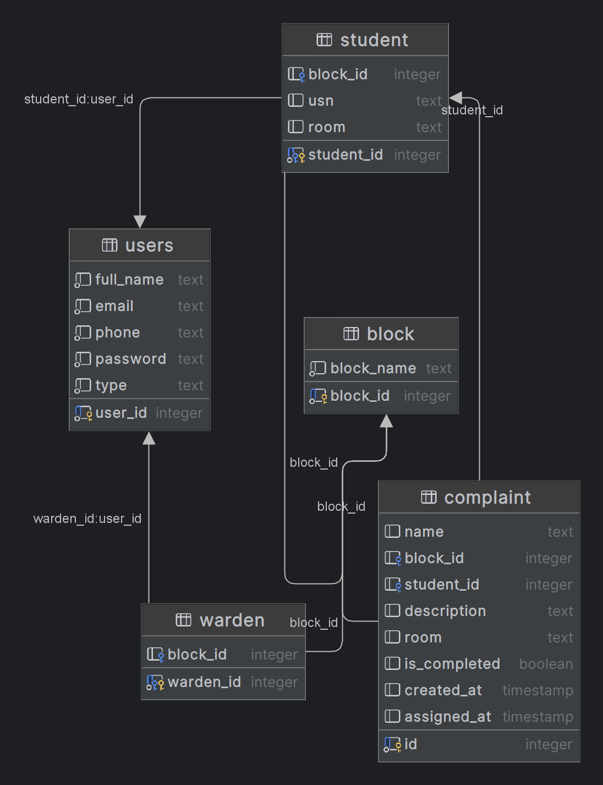

# Hostel Grievance Redressal System

## Overview

I developed the Hostel Grievance Redressal System as a full-stack web application to streamline the process of reporting, tracking, and resolving hostel-related issues. The platform allows residents to quickly submit grievances, while giving administrators the tools they need to efficiently manage and resolve them.

## Features

- **Clean, Easy-to-Use Interface**: Residents can submit grievances in just a few clicks.
  
- **Real-time Status Tracking**: Users are notified instantly when the status of their complaint changes.

- **Admin Dashboard**: Centralized dashboard for wardens/admins to view, prioritize, and act on grievances.

## Tech Stack

- **Frontend**: React.js for building a responsive, dynamic UI, styled with Tailwind CSS for a sleek, modern look.

- **Backend**: Node.js with Express.js for efficient server-side handling of requests.

- **Database**: PostgreSQL for reliable, scalable, and structured data storage.

## Component Library

This project utilizes Component Library Preline, ComponentLand for cards, pages, and other components. 

## Project Preview

### Login Page

.png)

### Signup Page

.png)

### Student Dashboard

.png)

### Student Profile Info

.png)

### Student submitting complaint

.png)

### Student Dashboard after submitting complaint

.png)

### Warden Dashboard 

.png)

### Warden Resolves complaint(clicking Not completed changes to Completed)

.png)

### Student Dashboard Updated

.png)

### Schema Diagram
  

## Author

Mohd Kaif 

